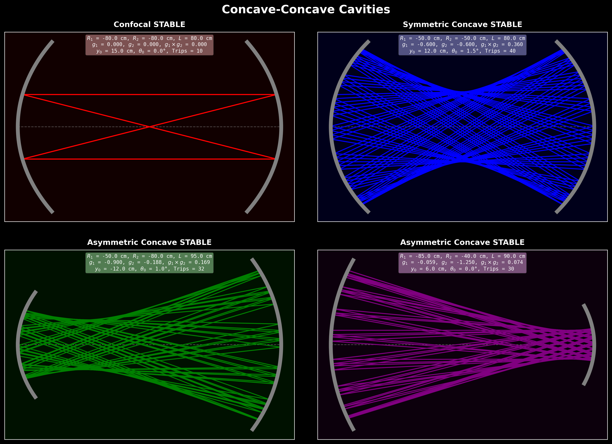
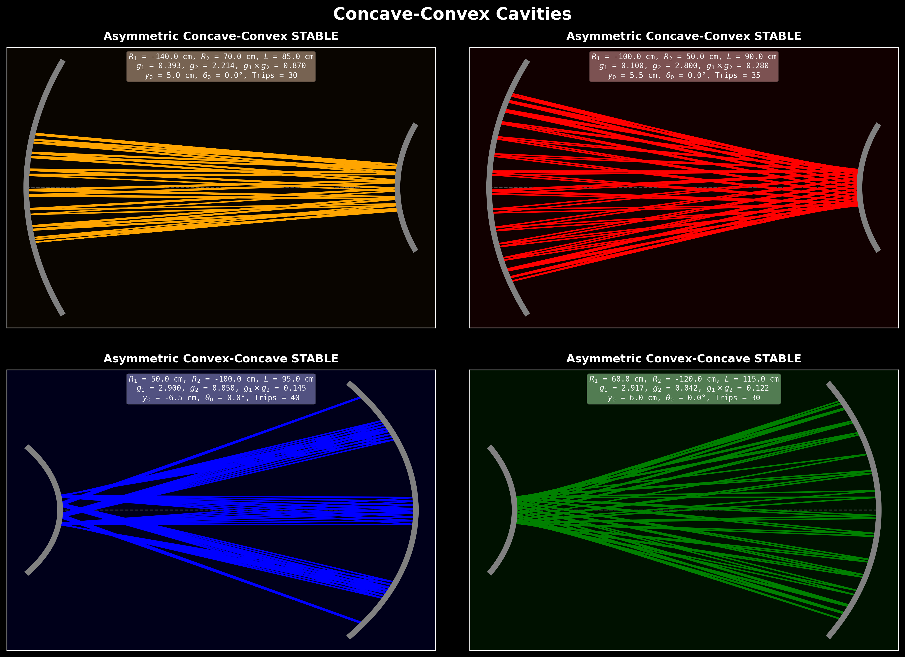
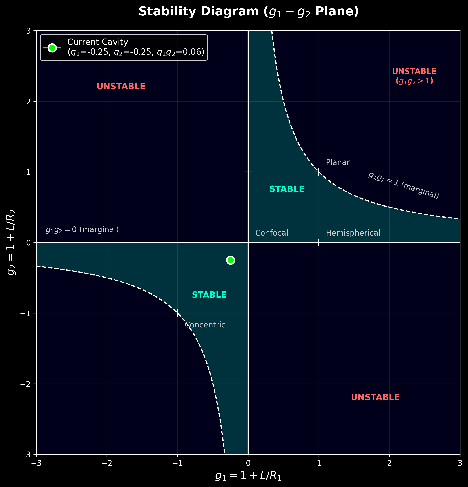
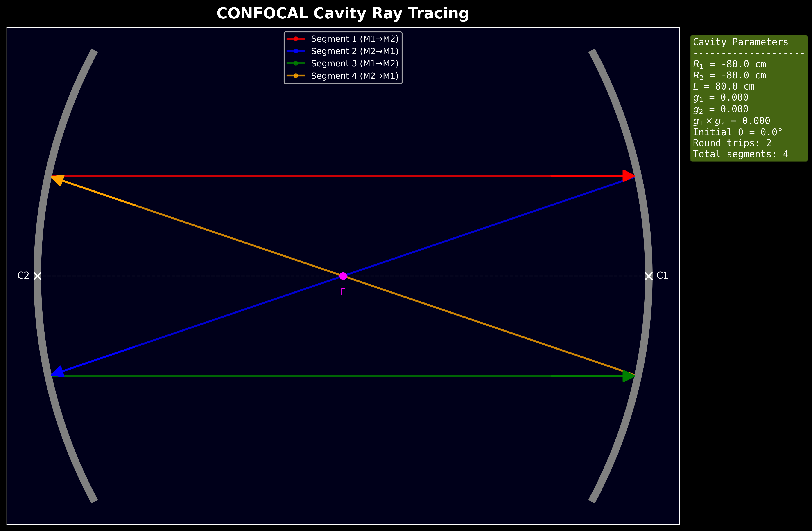
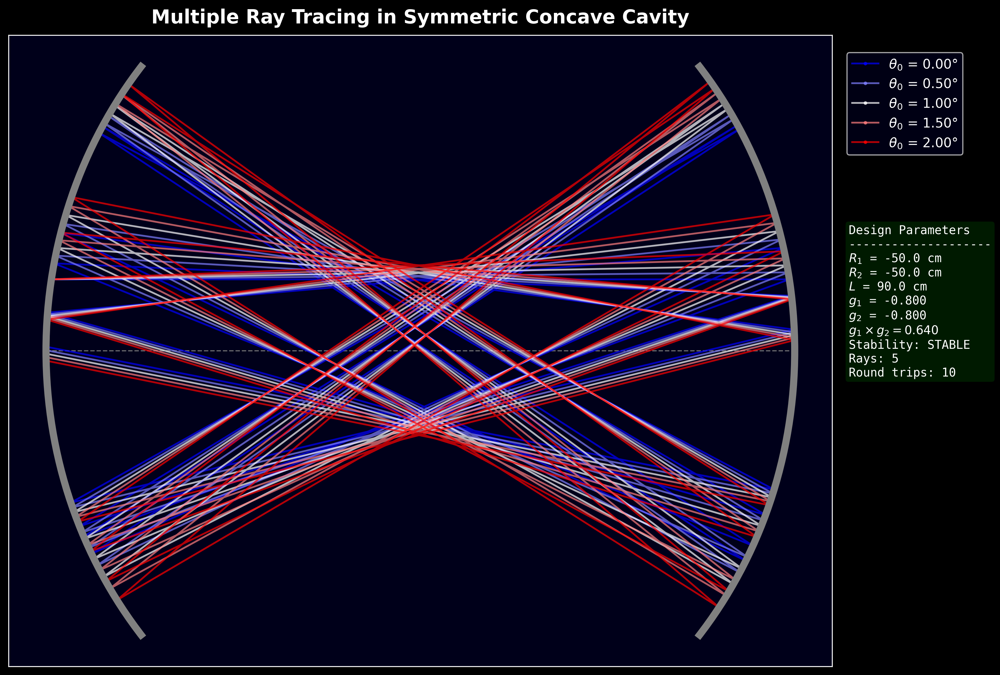
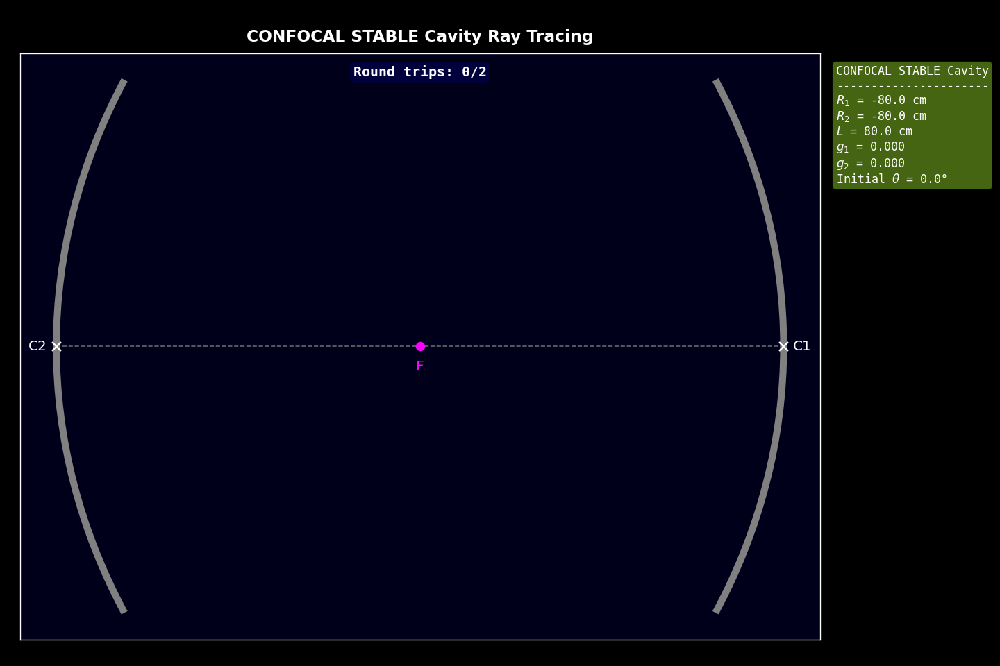
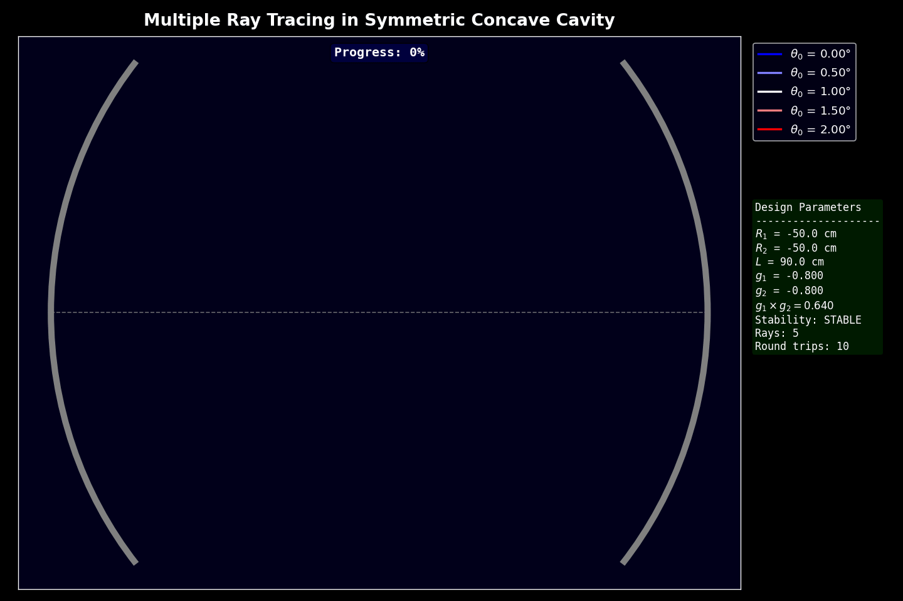
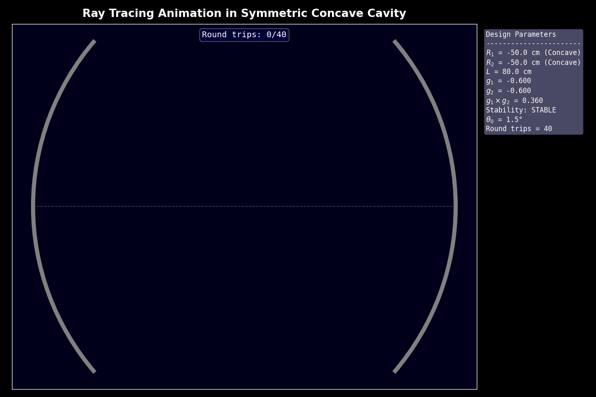
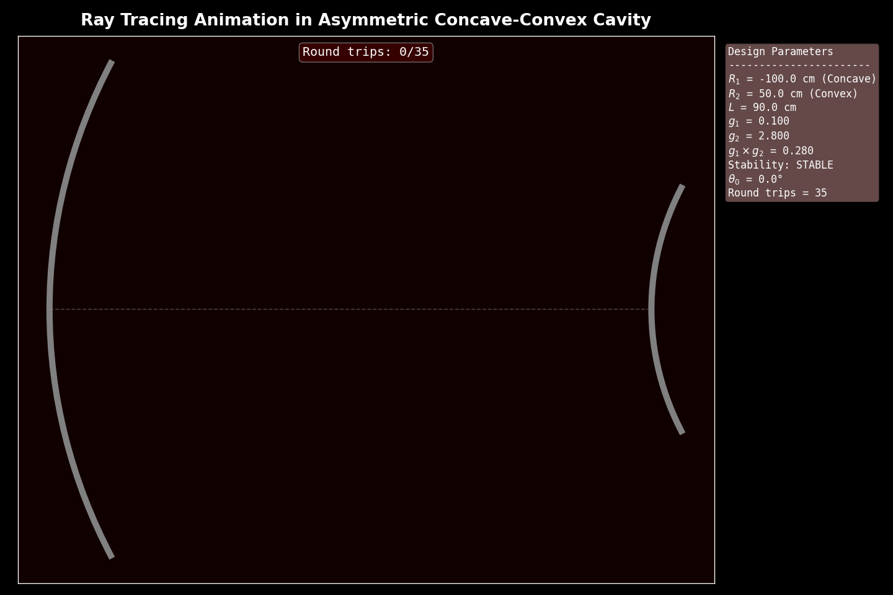

# Ray Tracing in Optical Resonators

> ABCD matrix analysis, cavity stability, and ray-path visualization for two-mirror optical resonators.

This repository studies paraxial ray propagation inside spherical-mirror optical cavities. It combines the ray transfer matrix method with cavity stability analysis and produces static plots and GIF animations for concave-concave and concave-convex resonator geometries.

The main notebook is [`resonator.ipynb`](resonator.ipynb), and the reusable Python implementation is in [`ray_tracing.py`](ray_tracing.py).

---

## Table of Contents

- [Ray Tracing in Optical Resonators](#ray-tracing-in-optical-resonators)
  - [Table of Contents](#table-of-contents)
  - [1. Highlights](#1-highlights)
  - [2. Physical Model](#2-physical-model)
    - [2.1 Ray Vector](#21-ray-vector)
    - [2.2 Propagation Matrix](#22-propagation-matrix)
    - [2.3 Mirror Reflection Matrix](#23-mirror-reflection-matrix)
    - [2.4 Round-Trip Matrix](#24-round-trip-matrix)
    - [2.5 Stability Condition](#25-stability-condition)
  - [3. Simulated Results](#3-simulated-results)
    - [3.1 Cavity Comparison Grids](#31-cavity-comparison-grids)
    - [3.2 Stability Diagram](#32-stability-diagram)
    - [3.3 Confocal Cavity](#33-confocal-cavity)
    - [3.4 Multiple-Ray Bundle](#34-multiple-ray-bundle)
    - [3.5 Animation Gallery](#35-animation-gallery)
      - [Static Figures](#static-figures)
      - [Animations](#animations)
  - [4. Project Structure](#4-project-structure)
  - [5. Installation](#5-installation)
  - [6. Usage](#6-usage)
    - [6.1 Run the Notebook](#61-run-the-notebook)
    - [6.2 Use the Python Script](#62-use-the-python-script)
  - [7. Example Cavities](#7-example-cavities)
  - [8. Notes and Limitations](#8-notes-and-limitations)
  - [9. References](#9-references)

---

## 1. Highlights

- Models two-mirror resonators using the ABCD matrix method.
- Supports concave-concave, concave-convex, convex-concave, and unstable convex configurations.
- Computes the resonator stability parameters $g_1$, $g_2$, and $g_1 g_2$.
- Traces single rays and multiple launch-angle ray bundles.
- Generates dark-theme publication-style static plots.
- Exports animated ray tracing as GIF files.
- Includes a $g_1 - g_2$ stability diagram with the selected cavity operating point.

---

## 2. Physical Model

The simulation is based on the paraxial (ray-transfer) matrix formalism. All propagation is performed in the paraxial approximation, and mirror surfaces are treated as thin optical elements.

### 2.1 Ray Vector

The state of a ray is described by the paraxial ray vector

$$
\mathbf{r} =
\begin{pmatrix}
y \\
\theta
\end{pmatrix}
$$

where $y$ is the transverse height from the optical axis and $\theta$ is the paraxial ray angle.

### 2.2 Propagation Matrix

Free-space propagation over distance $d$ is represented by

$$
P(d) =
\begin{pmatrix}
1 & d \\
0 & 1
\end{pmatrix}
$$

### 2.3 Mirror Reflection Matrix

The notebook uses the following mirror sign convention:

- **Concave mirror:** $R < 0$
- **Convex mirror:** $R > 0$

With that convention, reflection from a spherical mirror is implemented as

$$
M(R) =
\begin{pmatrix}
1 & 0 \\
\dfrac{2}{R} & 1
\end{pmatrix}
$$

### 2.4 Round-Trip Matrix

For a two-mirror cavity of length $L$, one complete round trip is

$$
M_{\mathrm{rt}} = M(R_1)\,P(L)\,M(R_2)\,P(L)
$$

### 2.5 Stability Condition

The stability parameters are defined as

$$
g_1 = 1 + \frac{L}{R_1}, \qquad
g_2 = 1 + \frac{L}{R_2}
$$

and the ideal paraxial stability condition is

$$
0 < g_1 g_2 < 1
$$

The code treats the inclusive range $0 \le g_1 g_2 \le 1$ as stable for reporting, while the notebook explains that $g_1 g_2 = 0$ and $g_1 g_2 = 1$ are marginal boundary cases.

---

## 3. Simulated Results

### 3.1 Cavity Comparison Grids

The comparison plots show how mirror curvature and cavity length change the boundedness and geometry of ray trajectories.

| Concave-concave cavities | Concave-convex cavities |
|:---:|:---:|
|  |  |

### 3.2 Stability Diagram

The stable region is shown in the $g_1$-$g_2$ plane. The marked point corresponds to a symmetric cavity with $R_1 = R_2 = -80$ cm and $L = 100$ cm.



### 3.3 Confocal Cavity

A symmetric confocal cavity satisfies

$$
L = |R_1| = |R_2|
$$

For the simulated case $R_1 = R_2 = -80$ cm and $L = 80$ cm, the focal points coincide at the cavity center and the ray retraces a closed path after two round trips.



### 3.4 Multiple-Ray Bundle

The ray bundle simulation launches five rays with different initial angles through a stable symmetric concave-concave cavity. The bundle spreads and refocuses while remaining confined within the resonator.



### 3.5 Animation Gallery

| Confocal ray tracing | Multiple-ray bundle |
|:---:|:---:|
|  |  |

| Symmetric concave-concave | Stable concave-convex |
|:---:|:---:|
|  |  |

Additional generated animations are available in [`OUTPUTS/ANIMATIONS`](OUTPUTS/ANIMATIONS), and additional static plots are available in [`OUTPUTS/PLOTS`](OUTPUTS/PLOTS).

<details>
<summary>More saved simulation outputs</summary>

#### Static Figures

| Description | File |
|---|---|
| Symmetric concave-concave, red ray | [View](OUTPUTS/PLOTS/symmetric_concave_concave_cavity_R1_-80.0_R2_-80.0_L_80.0_theta_0.0_rc_red_20260721_205857.png) |
| Symmetric concave-concave, blue ray | [View](OUTPUTS/PLOTS/symmetric_concave_concave_cavity_R1_-50.0_R2_-50.0_L_80.0_theta_1.5_rc_blue_20260721_205857.png) |
| Asymmetric concave-concave, green ray | [View](OUTPUTS/PLOTS/asymmetric_concave_concave_cavity_R1_-50.0_R2_-80.0_L_95.0_theta_1.0_rc_green_20260721_205857.png) |
| Asymmetric concave-concave, purple ray | [View](OUTPUTS/PLOTS/asymmetric_concave_concave_cavity_R1_-85.0_R2_-40.0_L_90.0_theta_0.0_rc_purple_20260721_205857.png) |
| Asymmetric concave-convex, red ray | [View](OUTPUTS/PLOTS/asymmetric_concave_convex_cavity_R1_-100.0_R2_50.0_L_90.0_theta_0.0_rc_red_20260721_195953.png) |
| Asymmetric concave-convex, orange ray | [View](OUTPUTS/PLOTS/asymmetric_concave_convex_cavity_R1_-140.0_R2_70.0_L_85.0_theta_0.0_rc_orange_20260721_195953.png) |
| Asymmetric convex-concave, blue ray | [View](OUTPUTS/PLOTS/asymmetric_convex_concave_cavity_R1_50.0_R2_-100.0_L_95.0_theta_0.0_rc_blue_20260721_195953.png) |
| Asymmetric convex-concave, green ray | [View](OUTPUTS/PLOTS/asymmetric_convex_concave_cavity_R1_60.0_R2_-120.0_L_115.0_theta_0.0_rc_green_20260721_195953.png) |

#### Animations

| Description | File |
|---|---|
| Symmetric concave-concave, red ray | [View](OUTPUTS/ANIMATIONS/symmetric_concave_concave_cavity_R1_-80.0_R2_-80.0_L_80.0_rc_red_20260721_205857.gif) |
| Symmetric concave-concave, blue ray | [View](OUTPUTS/ANIMATIONS/symmetric_concave_concave_cavity_R1_-50.0_R2_-50.0_L_80.0_rc_blue_20260721_205857.gif) |
| Asymmetric concave-concave, green ray | [View](OUTPUTS/ANIMATIONS/asymmetric_concave_concave_cavity_R1_-50.0_R2_-80.0_L_95.0_rc_green_20260721_205857.gif) |
| Asymmetric concave-concave, purple ray | [View](OUTPUTS/ANIMATIONS/asymmetric_concave_concave_cavity_R1_-85.0_R2_-40.0_L_90.0_rc_purple_20260721_205857.gif) |
| Asymmetric concave-convex, red ray | [View](OUTPUTS/ANIMATIONS/asymmetric_concave_convex_cavity_R1_-100.0_R2_50.0_L_90.0_rc_red_20260721_205857.gif) |
| Asymmetric concave-convex, blue ray | [View](OUTPUTS/ANIMATIONS/asymmetric_concave_convex_cavity_R1_-100.0_R2_50.0_L_90.0_rc_blue_20260721_195953.gif) |
| Asymmetric concave-convex, orange ray | [View](OUTPUTS/ANIMATIONS/asymmetric_concave_convex_cavity_R1_-140.0_R2_70.0_L_85.0_rc_orange_20260721_205857.gif) |
| Asymmetric convex-concave, blue ray | [View](OUTPUTS/ANIMATIONS/asymmetric_convex_concave_cavity_R1_50.0_R2_-100.0_L_95.0_rc_blue_20260721_205857.gif) |
| Asymmetric convex-concave, green ray | [View](OUTPUTS/ANIMATIONS/asymmetric_convex_concave_cavity_R1_60.0_R2_-120.0_L_115.0_rc_green_20260721_205857.gif) |

</details>

---

## 4. Project Structure

```text
Optical Resonator/
├── resonator.ipynb
├── ray_tracing.py
├── test.py
├── SKILLS.md
└── OUTPUTS/
    ├── PLOTS/
    └── ANIMATIONS/
```

| Path | Purpose |
|---|---|
| [`resonator.ipynb`](resonator.ipynb) | Main notebook containing theory, implementation, examples, plots, and animations. |
| [`ray_tracing.py`](ray_tracing.py) | Python script version with reusable cavity classes and an interactive CLI entry point. |
| [`OUTPUTS/PLOTS`](OUTPUTS/PLOTS) | Exported PNG figures from the notebook simulations. |
| [`OUTPUTS/ANIMATIONS`](OUTPUTS/ANIMATIONS) | Exported GIF animations from animated ray tracing runs. |

---

## 5. Installation

Create a Python environment and install the core scientific stack:

```bash
pip install numpy matplotlib ipympl pillow jupyter
```

For GIF export through Matplotlib's FFmpeg writer, install FFmpeg and make sure it is available on your system `PATH`.

> **Note:** If FFmpeg is not installed, the notebook can still display animations interactively, and the saving code can be adapted to use Pillow.

---

## 6. Usage

### 6.1 Run the Notebook

Start Jupyter from this directory:

```bash
jupyter notebook resonator.ipynb
```

The notebook is organized as follows:

| Section | Content |
|---|---|
| Theory | Ray vectors, propagation matrices, mirror matrices, round-trip matrix, and stability. |
| Core model | Cavity validation, mirror geometry, stability calculation, and ray propagation. |
| Static plotting | Single-ray plots, comparison grids, and stability diagrams. |
| Animation | Interpolated ray-front animation and GIF export. |
| Examples | Confocal cavity, concave-concave cases, concave-convex cases, and ray bundles. |

### 6.2 Use the Python Script

Run the interactive cavity simulator:

```bash
python ray_tracing.py
```

Or import the class directly in your own script:

```python
from ray_tracing import CavityRayTracing

cavity = CavityRayTracing(R1=-80.0, R2=-80.0, L=70.0)
cavity.print_info(y0_initial=15.5, theta0_initial_deg=0.0, N_round_trips=50)

fig, ax = cavity.visualize_single_ray(
    y0_initial=15.5,
    theta0_initial_deg=0.0,
    N_round_trips=50,
    ray_color="red",
    save_figure=True,
)
```

---

## 7. Example Cavities

| Case | Parameters | Interpretation |
|---|---|---|
| Symmetric confocal | $R_1 = R_2 = -80$ cm, $L = 80$ cm | Marginal boundary case with $g_1 = g_2 = 0$. |
| Symmetric concave-concave | $R_1 = R_2 = -50$ cm, $L = 80$ cm | Stable near-concentric trajectory. |
| Asymmetric concave-concave | $R_1 = -50$ cm, $R_2 = -80$ cm, $L = 95$ cm | Stable but geometrically asymmetric ray pattern. |
| Concave-convex | $R_1 = -100$ cm, $R_2 = 50$ cm, $L = 90$ cm | Stable when concave focusing dominates convex defocusing. |
| Ray bundle | $R_1 = R_2 = -50$ cm, $L = 90$ cm | Multiple launch angles remain bounded in a stable cavity. |

---

## 8. Notes and Limitations

- This is a **paraxial ray optics** model, not a full Gaussian beam or diffraction simulation.
- Mirror surfaces are drawn as spherical arcs, while propagation is handled through ABCD matrix updates.
- The stability classification follows the notebook convention $0 \le g_1 g_2 \le 1$, with boundary cases identified as marginal in the theory.
- Radii are expressed in **centimeters** in the examples.
- Very large ray heights or unstable configurations may escape the mirror aperture, at which point tracing stops.

---

## 9. References

1. A. E. Siegman, *Lasers*, University Science Books, 1986.
2. H. Kogelnik and T. Li, "Laser Beams and Resonators," *Applied Optics*, **5**(10), 1550-1567, 1966.
3. B. E. A. Saleh and M. C. Teich, *Fundamentals of Photonics*, Wiley.
